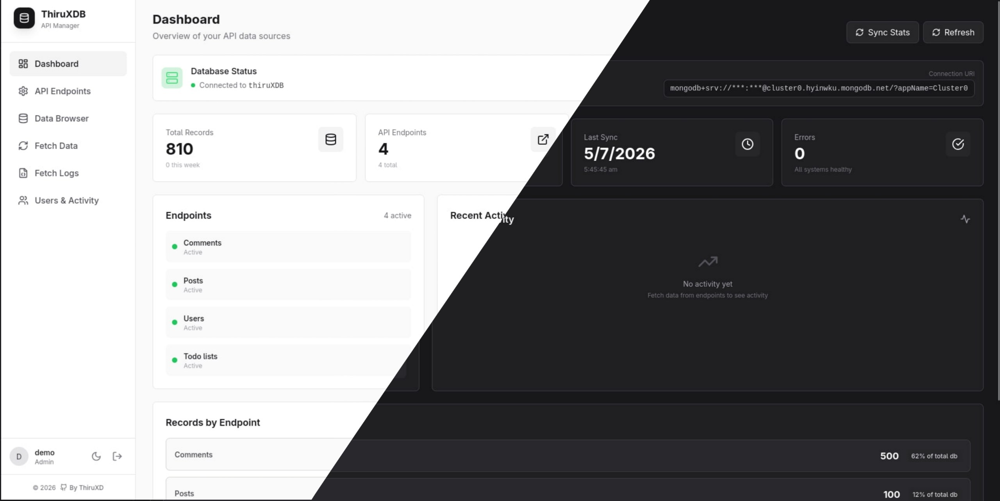

# ThiruXDB

> A self-hosted API data aggregation dashboard — configure external REST endpoints, fetch & store their data into MongoDB, browse and search records, all from a clean web UI.

---

## Live Demo
Check out the live deployment of ThiruXDB here:
- **URL:** [https://demo-thiruxdb.netlify.app/](https://demo-thiruxdb.netlify.app/)
- **Username:** `demo`
- **Password:** `demo@123`



---

## Features

- **Endpoint Manager** — Add, edit, activate/deactivate, and delete API endpoints with support for `None`, `Bearer`, `API Key`, and `Basic` authentication
- **Dynamic Path Variables** — Automatically orchestrate mass API fetching by injecting variables (like `{id}`) into URLs from another MongoDB collection's fields.
- **Custom Collections** — Store fetched data in a central `data_records` collection or automatically route it to dedicated custom collections.
- **Field Mappings** — Map and transform response fields (`string`, `number`, `boolean`, `date`) to a unified schema
- **One-click Fetch** — Pull data from a single endpoint or all active endpoints at once, with robust background fault tolerance and error skipping.
- **Cancellable & Resumable Sync** — Safely cancel active data syncs without corrupting data. Progress states (like `partial`) are stored persistently and seamlessly resume on refresh.
- **Ultra-Fast Database Insertion** — Automatically batches operations into memory and leverages MongoDB's `bulkWrite` API to insert thousands of records simultaneously at absolute maximum wire speed.
- **Data Browser** — Paginated table/grid view with date range filters, endpoint filtering, and full-text search.
- **Fetch Logs** — Complete history of every fetch operation with status, record counts, duration, and errors. Includes granular deletion and "Clear All" features to manage history.
- **High-Performance Dashboard** — Live stats cached directly on endpoint documents for instantaneous rendering of total records, active endpoints, and distributions.
- **Export** — Download current view as JSON or CSV
- **Mobile Responsive** — Fully optimized UI with sidebar overlays and responsive grids for managing data on the go.
- **Role-Based Access Control (RBAC)** — Three-tier permission system (`admin`, `editor`, `viewer`) utilizing JWTs and bcrypt password hashing.
- **Activity & IP Auditing** — Comprehensive user activity logs with automatic IP Geolocation (`ip-api.com`), tracking ISPs, Cities, and Device information.
- **Frappe UI "Espresso" Aesthetic** — Sleek, flat design layout natively built in React + Tailwind.
- **Global Light/Dark Mode** — Fully responsive theme switching that persists in local storage.
- **Local Auth** — Simple session-based admin login (no external auth service required)

---

## Tech Stack

| Layer | Technology |
|---|---|
| Runtime | [Bun](https://bun.sh) |
| Frontend | React 18 + TypeScript + Vite |
| Styling | Tailwind CSS |
| Backend | Express.js |
| Database | MongoDB (via native `mongodb` driver) |
| Icons | Lucide React |

---

## Project Structure

```
ThiruXDB/
├── server/                  # Express API backend
│   ├── index.js             # Server entry point (port 3001)
│   ├── db.js                # MongoDB connection + index setup
│   └── routes/
│       ├── endpoints.js     # CRUD for api_endpoints collection
│       ├── records.js       # Paginated records, upsert, text search
│       ├── logs.js          # Fetch logs with endpoint name join
│       └── dashboard.js     # Aggregated stats in one round-trip
├── src/                     # React frontend
│   ├── lib/
│   │   └── api.ts           # Typed fetch client (replaces Supabase client)
│   ├── types/
│   │   └── database.ts      # Shared TypeScript interfaces
│   ├── context/
│   │   └── AuthContext.tsx  # Local session auth
│   └── components/
│       ├── DashboardPage.tsx
│       ├── EndpointsPage.tsx
│       ├── EndpointForm.tsx
│       ├── FetchPage.tsx
│       ├── DataBrowserPage.tsx
│       ├── LogsPage.tsx
│       ├── LoginPage.tsx
│       └── Layout.tsx
├── .env.example             # Environment variable template
├── vite.config.ts           # Vite + /api proxy config
└── package.json             # Bun scripts
```


## Sync Engine Architecture & Deployment

ThiruXDB uses a highly optimized, state-persistent A self-hosted API data aggregation dashboard — configure external REST endpoints, fetch & store their data into MongoDB, browse and search records, all from a clean web UI. designed to handle large payloads (20MB+) while gracefully tolerating Serverless environments.

- **MongoDB State Tracking:** Sync progress is stored centrally in the `sync_jobs` collection. This allows multi-container Serverless environments (like Netlify or Vercel) to auto-scale without losing track of your download's progress or speed.
- **Detached Promise Execution:** By default, the engine spins up the sync as a detached background promise. This operates flawlessly out-of-the-box on any standard **VPS** or persistent Node.js environment.
- **Serverless Environments (Vercel):** When deployed to standard serverless functions (which strictly freeze upon HTTP response), the sync engine utilizes a "freeze and thaw" mechanism. The engine will pause execution when the function sleeps, and will instantly resume exactly where it left off when the frontend's 1-second UI polling tickles the container awake. (Note: this is perfectly safe, but will result in slower download speeds compared to a VPS).

> [!WARNING]
> **Cloudflare Pages / Workers are NOT supported.** The Express backend uses the native `mongodb` Node.js driver, which requires raw TCP socket access (`net` and `tls` modules). Cloudflare's V8 Isolates do not support these modules, meaning the backend will instantly crash if deployed to Cloudflare. Please use **Netlify**, **Vercel**, or a **VPS**.
- **Netlify Background Functions:** If `process.env.NETLIFY` is detected, the API will automatically route the sync task to a dedicated Netlify Background Function (`netlify/functions/sync-background.js`). This entirely bypasses the 10-second timeout freeze, running at full line-speed for up to 15 minutes!

---

## Getting Started

### Prerequisites

- [Bun](https://bun.sh) `>= 1.0`
- A MongoDB instance — [MongoDB Atlas free tier](https://www.mongodb.com/cloud/atlas) works great

### 1. Clone & Install

```bash
git clone https://github.com/ThiruXD/Endpoint-URL-Migration-To-MongoDB.git
cd Endpoint-URL-Migration-To-MongoDB
bun install
```

### 2. Configure Environment

```bash
cp .env.example .env
```

Edit `.env`:

```env
MONGODB_URI=mongodb+srv://<user>:<password>@cluster0.xxxxx.mongodb.net/?retryWrites=true&w=majority
MONGODB_DB=thiruXDB
PORT=3001
VITE_ADMIN_USERNAME=your_username_here
VITE_ADMIN_PASS=your_password_here
```

> **Note:** Bun loads `.env` automatically — no `dotenv` package required.

### 3. Run in Development

```bash
bun run dev
```

This starts both servers concurrently:
- **Vite** (frontend) → `http://localhost:5173`
- **Express API** → `http://localhost:3001`

Vite proxies all `/api/*` requests to the Express server, so the frontend just calls `/api/...`.

### 4. Login

Default credentials (change in `src/context/AuthContext.tsx`):

| Field | Value |
|---|---|
| Username | `your_username` |
| Password | `your_password` |

---

## MongoDB Collections

### `api_endpoints`
Stores configured API sources.

| Field | Type | Description |
|---|---|---|
| `_id` | ObjectId | Auto-generated |
| `name` | string | Display name |
| `collection_name` | string | Optional custom target collection (defaults to `data_records`) |
| `base_url` | string | The API URL to fetch |
| `path_variables` | array | Dynamic variables for URL injection (`variable`, `source_collection`, `source_field`) |
| `auth_type` | string | `none` \| `api_key` \| `bearer` \| `basic` |
| `auth_config` | object | Auth credentials (headers, token, etc.) |
| `field_mappings` | array | Source → target field transform rules |
| `response_path` | string | Dot-path to array in response (e.g. `data.results`) |
| `pagination_type` | string | `none` \| `offset` \| `cursor` \| `page` |
| `is_active` | boolean | Whether endpoint is enabled |
| `record_count` | number | Cached total of records belonging to this endpoint |
| `last_fetched_at` | Date | Timestamp of last successful fetch |
| `last_error` | string | Last error message, if any |

### `data_records`
Stores fetched records from all endpoints.

| Field | Type | Description |
|---|---|---|
| `endpoint_id` | ObjectId | Reference to `api_endpoints` |
| `external_id` | string | Original `id` / `_id` from source API |
| `raw_data` | object | Complete original response item |
| `mapped_data` | object | Transformed data per field mappings |
| `_search_text` | string | Stringified raw_data for `$text` index |
| `fetched_at` | Date | When this record was fetched |

### `fetch_logs`
Tracks every fetch operation.

| Field | Type | Description |
|---|---|---|
| `endpoint_id` | ObjectId | Reference to `api_endpoints` |
| `status` | string | `success` \| `error` \| `partial` |
| `records_fetched` | number | Total items in API response |
| `records_created` | number | New records inserted |
| `records_updated` | number | Existing records updated |
| `duration_ms` | number | Total fetch duration |
| `error_message` | string | Error detail, if any |

---

## API Reference

All routes are prefixed with `/api`.

| Method | Path | Description |
|---|---|---|
| `GET` | `/api/health` | Health check |
| `GET` | `/api/dashboard` | All dashboard stats in one call |
| `GET` | `/api/endpoints` | List all endpoints |
| `POST` | `/api/endpoints` | Create endpoint |
| `POST` | `/api/endpoints/sync-stats` | Re-calculates and repairs the `record_count` cache across all endpoints |
| `PUT` | `/api/endpoints/:id` | Update endpoint |
| `PATCH` | `/api/endpoints/:id/toggle` | Toggle active state |
| `PATCH` | `/api/endpoints/:id/status` | Update last_fetched_at / last_error |
| `DELETE` | `/api/endpoints/:id` | Delete endpoint + cascade records & logs |
| `GET` | `/api/records` | List records (paginated, filterable) |
| `GET` | `/api/records/search` | Full-text search |
| `GET` | `/api/records/counts` | Total + per-endpoint record counts |
| `POST` | `/api/records` | Upsert a record |
| `PUT` | `/api/records/:id` | Update mapped_data |
| `DELETE` | `/api/records/:id` | Delete record |
| `GET` | `/api/logs` | List fetch logs |
| `POST` | `/api/logs` | Create fetch log entry |

---

## Available Scripts

```bash
bun run dev          # Start Vite + Express concurrently
bun run dev:client   # Vite only
bun run dev:server   # Express only (with --watch hot reload)
bun run build        # Production Vite build
bun run typecheck    # TypeScript type checking
bun run lint         # ESLint
```

---

## Contributing

Contributions are highly encouraged and always welcome! We believe in the power of open-source and community collaboration. Whether you are fixing a bug, adding a new feature, or improving the documentation, your help is appreciated.

**How to contribute:**
1. Fork the repository.
2. Create your feature branch: `git checkout -b feature/my-new-feature`
3. Commit your changes: `git commit -m 'feat: Add some amazing feature'`
4. Push to the branch: `git push origin feature/my-new-feature`
5. Open a Pull Request!

If you're not a developer, you can still contribute by opening issues for bugs or suggesting new features.

---

## Credits

- **Author**: [ThiruXD](https://github.com/ThiruXD)
- **AI Assistance**: Built with the help of **Gemini AI** and **Claude AI** for architecture, complex logic refactoring, and UI enhancements.

---

## License

MIT
